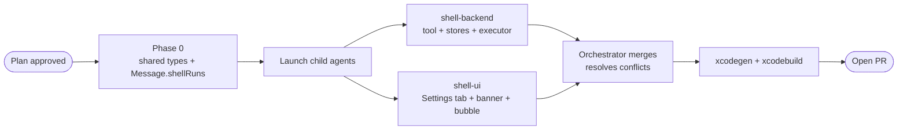

# 26.06.16 - SwiftMaestro Native Shell Tool (Refined Plan)

Add a native `shell_exec` tool to SwiftMaestro with authorized-folder cwd gating, editable allow/ask/deny policies, per-call approval for risky or unknown commands, live output streaming, and captured output returned to the model.

## Problem

SwiftMaestro currently has no native shell execution; `Sources/Engine/MaestroTools+Files.swift` explicitly says shell execution is intentionally not provided in the default beta build. That keeps the app safe, but it forces coding-agent workflows to depend on XcodeBuildMCP or shell MCP servers. The goal is first-class native shell execution without losing SwiftMaestro's local-first, permissioned design.

## Current State

- Native tool surface is centralized in `Sources/Engine/MaestroTools.swift`
- Feature-specific extensions: `MaestroTools+Files.swift`, `MaestroTools+System.swift`, `MaestroTools+Memory.swift`
- File tools enforce Settings → Context authorized folders via `SwiftMaestroSettingsStore.loadAuthorizedFolders()`
- `ChatViewModel` stores per-agent working directory
- `MessageBubble` renders tool-step disclosures (can be extended for shell output)
- Settings are UserDefaults-backed through `SwiftMaestroSettingsStore` in `Sources/Views/SettingsView.swift`
- `Message` model has `toolSteps: [String]?` (just tool names), `reasoning`, `reasoningSeconds`

## Design Overview

Implement a new `shell_exec` native tool available only when the user enables it in Settings. The tool accepts a literal command, optional cwd, optional timeout, and optional reason. It resolves cwd inside enabled Authorized Folders, classifies the command against user-editable safety policies, requests approval when needed, executes through `/bin/zsh`, streams stdout/stderr into the chat UI, and returns a bounded JSON result to the model.

## Safety Model (Three Layers)

### Layer 1: Hard-Deny Regex Patterns

Commands that NEVER run and cannot be approved from the banner:
- `rm -rf /`, `rm -rf ~`, `dd if=`, `mkfs*`, `shutdown*`, `reboot`, `poweroff`
- `sudo*` (unless explicitly added to Always Allow by user)
- Recursive ownership changes under root paths: `chown -R root:*`, `chmod -R 777 /`
- Writes into system paths: `* > /etc/*`, `* > /usr/*`, `tee /etc/*`
- Dangerous downloads: `curl * | sh`, `wget * | bash`, `curl * | bash`

### Layer 2: Authorized-Folder Cwd Gate

The resolved cwd must equal or be nested under an enabled folder from Settings → Context:
- Tool-provided cwd wins; otherwise use the calling agent's working directory; otherwise use the first enabled authorized folder
- If none is valid, return `access_denied` result with clear message

### Layer 3: Command Classification

- **Always-allow matches**: Run immediately without approval
- **Always-ask matches**: Require user approval before execution
- **Unknown commands**: Require approval; offer "approve and remember" to add to allow-list

## New Types (Phase 0 - Shared)

### ShellRunSnippet (for Message.shellRuns)

```swift
struct ShellRunSnippet: Identifiable, Codable {
    var id: UUID
    let command: String
    let cwd: String
    let exitCode: Int?
    let stdout: String
    let stderr: String
    let durationMs: Int
    let timedOut: Bool
    let truncated: Bool
    var status: ShellRunStatus
}

enum ShellRunStatus: String, Codable {
    case running = "running"
    case completed = "completed"
    case failed = "failed"
    case timeout = "timeout"
    case denied = "denied"
    case approval_timeout = "approval_timeout"
}
```

### ShellOutputChunk (for live streaming)

```swift
struct ShellOutputChunk: Codable {
    let id: UUID
    let stdout: String?
    let stderr: String?
    let isFinal: Bool
}
```

### ShellApprovalRequest (existing, now with ShellPolicyClassification alias)

```swift
struct ShellApprovalRequest: Identifiable, Codable {
    var id: UUID
    let command: String
    let cwd: URL
    let classification: ShellPolicyClassification  // typealias to ShellClassification
    let reason: String?
    let agentName: String
}
```

### Message Model Extension

```swift
struct Message: Identifiable, Codable {
    // ... existing fields ...
    var shellRuns: [ShellRunSnippet]?  // NEW: structured shell execution results
}
```

### AgentOutput Extension (for executor events)

```swift
enum AgentOutput {
    case token(String)
    case toolCall(name: String)
    case info(tokensPerSecond: Double)
    case turnBreak
    case awaitingApproval(ShellApprovalRequest)  // NEW: pause for user approval
    case shellOutput(ShellOutputChunk)            // NEW: live stdout/stderr stream
}
```

## Shell Settings Tab

Add a new Settings → Shell tab (between MCP and Storage) with:

### Controls

- **Master toggle**: Enable shell tool (defaults OFF)
- **Always Allow list**: Editable command prefixes/regex patterns (defaults: read-only git/ls/cat commands)
- **Always Ask list**: Editable command prefixes/regex patterns (defaults: side-effectful commands)
- **Never Allow list**: Hard-deny patterns (defaults: destructive system commands)
- **Default timeout**: Seconds (default: 60, range: 5-300)
- **Output cap**: Max bytes per stream (default: 64KB)
- **Login shell**: Use `zsh -lic` vs `zsh -c` (defaults ON)
- **Max concurrent calls**: Integer (default: 3)

### Persistence Keys

```swift
private static let shellEnabledKey = "settings.shell.enabled"
private static let shellAlwaysAllowKey = "settings.shell.alwaysAllow"
private static let shellAlwaysAskKey = "settings.shell.alwaysAsk"
private static let shellNeverAllowKey = "settings.shell.neverAllow"
private static let shellDefaultTimeoutKey = "settings.shell.defaultTimeout"
private static let shellOutputCapKey = "settings.shell.outputCap"
private static let shellLoginShellKey = "settings.shell.loginShell"
private static let shellMaxConcurrentKey = "settings.shell.maxConcurrent"
```

## Default Command Policies

### Always Allow (read-only inspection)

`git status`, `git log`, `git diff`, `git show`, `git branch`, `git rev-parse`, `git remote`, `git tag`, `git fetch`, `git describe`, `ls`, `pwd`, `cat`, `head`, `tail`, `wc`, `which`, `type`, `date`, `uname`, `xcodebuild -list`, `xcodebuild -version`, `swift --version`, `node --version`, `python3 --version`, `brew list`, `brew info`, `brew outdated`

### Always Ask (side-effectful or long-running)

`git push`, `git reset --hard`, `git rebase`, `git clean`, `git commit --amend`, `xcodebuild build`, `xcodebuild clean`, `xcodebuild test`, `xcodebuild archive`, `brew install`, `brew uninstall`, `brew upgrade`, `npm install`, `npm publish`, `pip install`, `make`, `docker`, `kubectl`

### Never Allow (hard-deny, non-editable in UI)

`rm -rf /`, `rm -rf ~`, `dd if=`, `mkfs*`, `shutdown*`, `reboot`, `poweroff`, `sudo*`, `chown -R root:*`, `chmod -R 777 /`, `* > /etc/*`, `* > /usr/*`, `curl * | sh`, `wget * | bash`

## Approval UI

### ShellApprovalBanner View

When a shell call requires approval, show a banner above the composer:

- Agent name (who requested)
- Command (editable text field)
- Cwd (read-only, shows resolved path)
- Classification badge (always_allow / always_ask / unknown / never_allow)
- Model-supplied reason (if provided)
- Actions: Deny, Approve Once, Approve and Remember

### Behavior

- Pending approval expires after 10 minutes → returns `approval_timeout`
- If user edits the command, reclassify before execution:
  1. Re-check against Never Allow (deny if matches)
  2. Re-classify (may change from allow→ask if edited)
  3. Validate cwd is still authorized

## Execution Behavior

### Tool Schema

```swift
private static var shellToolSpecs: [ToolSpec] {
    [
        rawSpec("shell_exec",
            "Execute a shell command. Requires approval for risky commands. " +
            "Command output is streamed to the chat and returned as structured JSON.",
            properties: [
                "command": ["type": "string", "description": "The command to execute."],
                "cwd": ["type": "string", "description": "Working directory (must be in authorized folders)."],
                "timeout": ["type": "integer", "description": "Timeout in seconds (default: 60, max: 300)."],
                "reason": ["type": "string", "description": "Why this command is needed (shown in approval UI)."],
            ], required: ["command"])
    ]
}
```

### Execution Flow

1. **Parse arguments**: Extract command, cwd, timeout, reason from JSON
2. **Resolve cwd**: 
   - Use provided cwd if present and valid
   - Otherwise use agent's workingDirectory
   - Otherwise use first authorized folder
   - If invalid → return `access_denied`
3. **Classify command**: Match against Never Allow → Always Allow → Always Ask → unknown
4. **Check approval**:
   - If never_allow → return `command_denied` immediately
   - If always_allow → execute immediately
   - If always_ask or unknown → yield `.awaitingApproval(request)` and suspend
5. **Execute**:
   - Use `Foundation.Process` with `/bin/zsh`
   - Login mode: `-lic "command"`; normal mode: `-c "command"`
   - Set `currentDirectoryURL` to resolved cwd
   - Capture stdout/stderr with separate pipes
   - Stream output via `.shellOutput` events
   - Cap each stream to configured byte limit
   - Terminate on timeout
6. **Return result**: JSON-serialized `ShellExecResult`

### ShellExecResult (tool output format)

```swift
struct ShellExecResult: Codable {
    let command: String
    let cwd: String
    let exitCode: Int?
    let stdout: String
    let stderr: String
    let durationMs: Int
    let timedOut: Bool
    let truncated: Bool
}
```

The tool returns `JSONEncoder().encode(result)` as a string, which the model can parse.

## Live Output in Chat

### MessageBubble Extension

Add a new disclosure under tool steps for shell runs:

```swift
if let shellRuns = message.shellRuns, !shellRuns.isEmpty, !isUser {
    ForEach(shellRuns) { run in
        DisclosureGroup {
            VStack(alignment: .leading, spacing: 4) {
                Text("Command: `\(run.command)`")
                    .font(.caption.monospaced())
                Text("Cwd: \(run.cwd)")
                    .font(.caption2.foregroundStyle(.secondary))
                Text("Status: \(run.status.rawValue)")
                    .font(.caption2.foregroundStyle(statusColor))
                if !run.stdout.isEmpty {
                    Text(run.stdout)
                        .font(.caption2.monospaced())
                        .foregroundStyle(.secondary)
                }
                if !run.stderr.isEmpty {
                    Text(run.stderr)
                        .font(.caption2.monospaced())
                        .foregroundStyle(.red)
                }
                Text("Duration: \(run.durationMs)ms")
                    .font(.caption2.foregroundStyle(.secondary))
            }
            .frame(maxWidth: .infinity, alignment: .leading)
        } label: {
            Label("Shell: \(run.command.prefix(30))",
                  systemImage: iconForStatus(run.status))
                .font(.caption)
                .foregroundStyle(.secondary)
        }
    }
}
```

### ChatViewModel Coordination

Extend `consumeStreamChunk` to handle `.shellOutput`:

```swift
for try await output in stream {
    switch output {
    case .token(let token): consumeStreamChunk(token)
    case .toolCall(let name): recordToolStep(name)
    case .info(let tps): engine.reportExternalTokensPerSecond(tps)
    case .turnBreak: beginSteeredTurn()
    case .awaitingApproval(let request): handleApprovalRequest(request)
    case .shellOutput(let chunk): updateLiveShellOutput(chunk)
    }
}
```

## Concurrency Control

### ShellExecutionQueue (actor)

```swift
actor ShellExecutionQueue {
    private var activeCount = 0
    private let maxConcurrent: Int
    private var semaphore: AsyncSemaphore
    
    init(maxConcurrent: Int) {
        self.maxConcurrent = maxConcurrent
        self.semaphore = AsyncSemaphore(value: maxConcurrent)
    }
    
    func execute<T>(_ work: @escaping () async throws -> T) async throws -> T {
        try await semaphore.acquire()
        defer { semaphore.release() }
        return try await work()
    }
}
```

Inject into `ShellPolicyStore` and use before executing commands.

## Files to Add or Edit

### New Files

- `Sources/Engine/MaestroTools+Shell.swift` - shell tool specs and execution
- `Sources/Services/ShellPolicyStore.swift` - policy management + persistence
- `Sources/Services/ShellApprovalStore.swift` - approval tracking
- `Sources/Services/ShellExecutionQueue.swift` - concurrency control
- `Sources/Views/ShellApprovalBanner.swift` - approval UI
- `Sources/Views/SettingsView+Shell.swift` - Settings tab

### Modified Files

- `Sources/Models/SwiftMaestroModels.swift` - add `ShellRunSnippet`, `ShellRunStatus`, `ShellOutputChunk`, extend `Message`
- `Sources/Engine/MaestroTools.swift` - register `shell_exec` in `handles`, `execute`, `schemas(navigator:)`
- `Sources/Adapters/AgentExecutor.swift` - add `.awaitingApproval` and `.shellOutput` to `AgentOutput`
- `Sources/ViewModels/ChatViewModel.swift` - handle new output types, coordinate approval flow
- `Sources/Views/MessageBubble.swift` - render shell run disclosures
- `Sources/Views/ChatView.swift` - host approval banner above composer
- `Sources/Views/SettingsView.swift` - add Shell tab

## Orchestration

### Phase 0 (Orchestrator - Sequential)

Create integration branch `orchestrator/shell-tool` off `main`, commit:
- `ShellRunSnippet`, `ShellRunStatus`, `ShellOutputChunk` types
- `Message.shellRuns` field
- `AgentOutput` extensions (`.awaitingApproval`, `.shellOutput`)
- `ShellPolicyClassification` typealias

### Phase 1 (Children - Parallel)

**shell-backend** (local git worktree):
- Workspace: `~/GitHub/AI-ML-Agents/SwiftMaestro-wt-shell-backend`
- Branch: `orchestrator/shell-backend` (base: `orchestrator/shell-tool`)
- Owns: `MaestroTools+Shell.swift`, `ShellPolicyStore.swift`, `ShellApprovalStore.swift`, `ShellExecutionQueue.swift`
- Edits: `MaestroTools.swift` (register tool), `AgentExecutor.swift` (approval suspension)
- Validation: Backend compiles; smoke description of allow/ask/deny paths, timeout, output cap, concurrency

**shell-ui** (local git worktree):
- Workspace: `~/GitHub/AI-ML-Agents/SwiftMaestro-wt-shell-ui`
- Branch: `orchestrator/shell-ui` (base: `orchestrator/shell-tool`)
- Owns: `ShellApprovalBanner.swift`, `SettingsView+Shell.swift`
- Edits: `SettingsView.swift` (Shell tab), `ChatView.swift` (banner host), `MessageBubble.swift` (shell disclosures)
- Validation: SwiftUI previews compile; description of approval/run/denied/timeout states

### Phase 2 (Orchestrator - Sequential)

1. Merge `shell-backend` into `orchestrator/shell-tool`
2. Merge `shell-ui` into `orchestrator/shell-tool`
3. Run `xcodegen generate` (if files added)
4. Run `xcodebuild -project SwiftMaestro.xcodeproj -scheme SwiftMaestro -configuration Debug -destination "platform=macOS" CODE_SIGNING_REQUIRED=NO build`
5. Resolve any wiring fallout
6. Open PR to `main`

### Diagram



## Validation

### Build

Run `xcodegen generate` if needed, then:
```bash
xcodebuild -project SwiftMaestro.xcodeproj -scheme SwiftMaestro -configuration Debug \
  -destination "platform=macOS" CODE_SIGNING_REQUIRED=NO build
```
Require `** BUILD SUCCEEDED **`

### Manual Smoke Tests

1. **Safe command**: `git status` → should run immediately (always_allow)
2. **Always-ask command**: `git push origin main` → should show approval banner
3. **Hard-denied command**: `rm -rf /` → should return `command_denied` immediately
4. **Cwd outside authorized folders**: should return `access_denied`
5. **Edited approval**: modify command in banner → should re-validate
6. **Output truncation**: long-running command → should cap output
7. **Timeout**: command exceeding timeout → should terminate and report
8. **Approval timeout**: leave banner pending >10min → should expire

## Out of Scope

- No interactive PTY support in v1 (vim, top, password prompts not supported)
- No per-project policies in v1 (policies are global)
- No separate remote-shell tool (SSH commands handled by normal shell policy if allowed)

---

## Appendix: Risk Assessment

| Risk | Mitigation |
|------|------------|
| Command injection via edited approval | Re-classify edited commands against all safety layers |
| Model spamming shell calls | Concurrency limit (max 3) + user approval for risky commands |
| Destructive commands | Hard-deny patterns + cwd gating |
| Resource exhaustion (fork bombs) | Timeout + output cap + concurrency limit |
| Privacy (leaking sensitive data) | Cwd gating restricts to authorized folders only |
